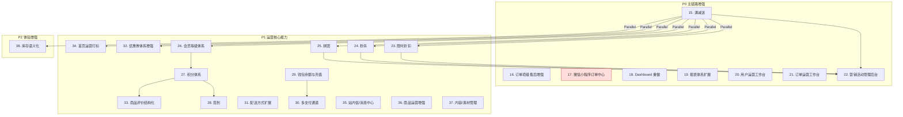

# Enhanced Features Roadmap

> Last Updated: 2026-06-28 (P17 → out-of-scope reconciliation)
> Source: `docs/analysis/2026-06-21-mobile-mall-functional-design-analysis.md`, `docs/design/*.md`

## Purpose

本文是基于三项目移动商城分析报告（芋道/c-shopping/新蜂）识别出的功能增强建议而新增的 roadmap，覆盖 litemall 缺失的 P0/P1 运营能力和后台完善项。

本文是 `docs/backlog/implementation-roadmap.md` 的补充，不替代原有 14 个阶段的商业闭环路线。**原有 14 个阶段（Phase 1-14）是实施本 roadmap 的前置条件。**

**范围边界：** 本文仅覆盖 **后端 API + AMIS Web 前台 + AMIS Admin 后台**。移动端前端（基于 nop-chaos-flux）有独立的 roadmap：`docs/backlog/mobile-frontend-roadmap.md`。两者共享同一套后端 API。

**核心用途：** AI 读完本文后即可知道哪些增强能力尚未实现、哪些已有计划、哪些已经完成，无需重新遍历分析报告和设计文档。

## Phase Status

> **状态更新只改这里，不改 Phase Details 中的状态行。**

- 15. 满减送: `done`（`docs/plans/2026-06-27-1742-1-phase15-full-discount-promotion-plan.md`）
- 16. 订单项级售后增强: `done`（`docs/plans/2026-06-27-1742-3-phase16-order-item-aftersale-plan.md`；P16/P21 Deferred successor「售后退货履约」已闭环：`docs/plans/2026-06-28-2042-1-aftersale-return-fulfillment-plan.md` done — GOODS_REQUIRED 走 APPROVED→RETURNED→REFUND 子状态机 + `submitReturnLogistics`/`confirmReturnReceived` mutation + 退货物流字段[returnShipChannel/returnShipSn/returnTime/receiveConfirmTime] + 还库从 refund() 拆到 confirmReturnReceived + Admin 待收货 Tab + 386 测试全绿）
- 17. 微信小程序订单中心: `out-of-scope（reconciliation）`（`docs/plans/2026-06-28-2319-1-phase17-wx-mini-program-order-center-plan.md` Phase 1 Decision = Option A，三轮独立 plan audit 共识确认）— 本商城不交付微信小程序前端（`user-and-address.md` H5/Web 定位 + `mobile-frontend-roadmap.md` React/nop-chaos-flux 技术栈），合规义务无附着主体；契约设计与未来 successor 触发条件已落地 `order-and-cart.md`「微信小程序订单中心」章节。触发条件：微信小程序立项 + WeChat 合规 ask-first 授权时重开 successor 计划。
- 18. Dashboard 重做: `done`（`docs/plans/2026-06-28-1027-1-phase18-dashboard-redesign-plan.md`；4 看板 `@BizQuery`[getDashboardMetrics/getSalesTrend/getRealtimeOrders/getTodoAggregation] + AMIS chart 指标卡/趋势/实时订单流/待办聚合 4 区块 + owner doc 口径；nop-report 引擎按引擎定位归 P19 导出场景）
- 19. 报表体系扩展: `done`（`docs/plans/2026-06-28-1027-2-phase19-report-system-extension-plan.md`；销售漏斗/用户分析[含生命周期]/商品分析/订单分析/优惠券分析 + 4 报表页 + CSV 导出[E1 抉择 CSV 兜底，nop-report 为 successor]；8 新增 `@BizQuery` 挂 LitemallOrderBizModel[E2 抉择] + SQL-lib `<c:if>` 条件查询 + Java cohort/RFM/lifecycle 分组；289 测试全绿；活动 ROI 归 P22，毛利归 successor）
- 20. 用户运营工作台: `done`（`docs/plans/2026-06-28-0340-2-phase20-user-operations-workbench-plan.md`；P20 deferred successor「算法化用户画像/RFM/生命周期」已闭环：`docs/plans/2026-06-28-1822-2-user-portrait-algorithmization-plan.md` done — per-user all-time 画像 `getUserPortrait` + 算法化分群 `getSegmentMembers` + 用户详情算法画像面板 + segment 三 Tab[手工标签/RFM/生命周期] + P19 分类逻辑同源抽取 `computeRfmThresholds`/`classifyLifecycleStage`[零回归] + `getUserPaymentSummaryAllTime` SQL TOTAL_AMOUNT 修正；360 测试全绿；P20 deferred successor「自动化会员专属券/生日礼包发放」已闭环：`docs/plans/2026-06-29-0900-2-member-benefits-automation-plan.md` done — Coupon minMemberLevel 等级准入 + confirm 路径 evaluateUserLevel 自动升级 + 等级提升发券 + dispatchBirthdayCoupons 定时任务 + 站内信通知 + 前台领券中心/个人中心权益视图；450 测试全绿）
- 21. 订单运营工作台: `done`（`docs/plans/2026-06-28-0340-3-phase21-order-operations-workbench-plan.md`）
- 22. 营销活动管理后台: `done`（`docs/plans/2026-06-28-0340-1-phase22-marketing-management-backend-plan.md` ORM-independent slice + `docs/plans/2026-06-28-1610-1-phase22-promotion-usage-model-gap-plan.md` ORM-dependent slice：PromotionUsage 实体 + flashSaleSessionId 列 + maxPerUser 强一致 + 按活动/按场次归因 + 效果看板秒杀面板）
- 23. 限时折扣: `done`（`docs/plans/2026-06-27-2029-2-phase23-time-discount-plan.md`）
- 24. 秒杀: `done`（`docs/plans/2026-06-28-0125-1-phase24-flash-sale-plan.md`）
- 25. 拼团: `done`（`docs/plans/2026-06-28-0125-2-phase25-pin-tuan-plan.md`）
- 26. 会员等级体系: `done`（`docs/plans/2026-06-27-1742-2-phase26-member-level-system-plan.md`）
- 27. 积分体系: `done`（`docs/plans/2026-06-27-2029-1-phase27-points-system-plan.md`）
- 28. 签到: `done`（`docs/plans/2026-06-27-2321-1-phase28-check-in-plan.md`）
- 29. 钱包余额与充值: `done`（`docs/plans/2026-06-28-1400-1-phase29-wallet-recharge-plan.md`；钱包账户[懒创建+乐观锁原子操作]+流水[balanceAfter快照]+充值流程[套餐存LitemallSystem JSON + outTradeNo派生RC前缀 + PaymentCallback回调路由]）
- 30. 多支付通道: `done`（`docs/plans/2026-06-28-1822-1-phase30-multi-payment-channels-plan.md`；PayChannel 策略抽象[<ioc:collect-beans> 注册表，能力位 AND pay_channels JSON 操作开关]+微信适配为通道保持 PayService facade + 余额支付[payByBalance @BizMutation，debitBalance PAY/sourceType=pay，markOrderPaidCore 抽取，IPasswordEncoder 校验登录密码]+ 支付宝通道骨架[enabled=false 示例回退，真实 SDK 为 successor]+ 收银台动态通道列表 + 退款异步通知对账[onRefundSuccess 幂等]）
- 31. 配送方式扩展（自提）: `done`（`docs/plans/2026-06-28-0530-3-phase31-pickup-delivery-plan.md`）
- 32. 优惠券体系增强: `done`（`docs/plans/2026-06-27-2321-3-phase32-coupon-center-plan.md`）
- 33. 商品评价结构化: `done`（`docs/plans/2026-06-27-2321-2-phase33-structured-comment-plan.md`）
- 34. 首页运营打标: `done`（`docs/plans/2026-06-27-2029-3-phase34-homepage-operation-tagging-plan.md`）
- 35. 站内信/消息中心: `done`（`docs/plans/2026-06-28-0530-1-phase35-message-center-plan.md`）
- 36. 商品运营增强: `done`（`docs/plans/2026-06-28-1027-3-phase36-goods-operations-enhancement-plan.md`；批量改价/改库存/上下架 + 导入[xlsx via ExcelHelper]/导出[CSV 兜底] + 库存预警[per-SKU `safeStock`+全局回退] + 评论工作台[回复/后置 Moderation]；前置审核状态机 successor 已闭环：`docs/plans/2026-06-28-2042-2-comment-pre-moderation-plan.md` done — `auditStatus` 字段+字典 + 预审开关 `mall_comment_pre_moderation` + `batchAuditComments`(approve/reject) + 公共查询过滤[doFind*ByQueryDirectly OR isNull/eq APPROVED] + 积分延迟至 approve 发放[幂等] + 工作台 auditStatus 筛选/批量通过拒绝；397 测试全绿）
- 37. 内容/素材管理: `done`（`docs/plans/2026-06-28-1400-2-phase37-material-management-plan.md`；素材上传[复用 IFileStore，MIME/扩展名推断 fileType]/搜索[keyword/categoryId/fileType/tag 组合]/分类树[内存组树按 sortOrder] + 前端素材库页[缩略图+上传弹窗+多维筛选]/分类管理页；跨实体引用关系追踪 + 云存储[nop-integration-file-*]为 Deferred successor[roadmap 偏差已裁定]）
- 38. 库存语义化: `done`（`docs/plans/2026-06-28-0530-2-phase38-stock-semantics-plan.md`）

## Status Values

| Status | 含义 |
|--------|------|
| `todo` | 尚未开始，无对应 plan |
| `planned` | 已有对应 execution plan |
| `done` | 已完成并通过 closure audit |

## Nop Platform Reuse

以下平台能力对本 roadmap 的增强功能有复用价值（来自 `implementation-roadmap.md` 的已有引入 + 新增依赖评估）：

| 能力 | 平台模块 | 引入状态 | 本 roadmap 复用方式 |
|------|----------|----------|---------------------|
| 用户认证（登录/登出/token/密码哈希） | nop-auth | 已引入 | 会员等级扩展 NopAuthUser 的 Delta |
| 用户管理（CRUD/状态/角色分配/RBAC） | nop-auth | 已引入 | 用户运营工作台复用 RBAC 判断 |
| 系统配置（全局 key-value） | nop-sys NopSysVariable | 已引入 | 满减/秒杀/签到等活动配置参数存储 |
| 字典管理 | nop-sys | 已引入 | 售后原因字典化（仅退款/退货退款两类） |
| 通知模板 | nop-sys NopSysNoticeTemplate | 已引入 | 站内信/消息中心的模板复用 |
| 定时任务调度 | nop-job-local | 已引入（Phase 11） | 秒杀场次状态切换、拼团超时失败、订单超时取消；签到采用即时计算无需调度 |
| 报表引擎 | nop-report | 已引入（nop-report-core + nop-report-pdf，计划 `2026-06-28-2352-1`） | 模板化导出（商品 + funnel/product/order 报表 xlsx/pdf）；Dashboard 看板已由 AMIS chart 交付 |
| SMS/Email 通道 | nop-integration | 未引入 | 站内信可扩展为多渠道通知 |
| 文件存储 | nop-integration-file-* | 未引入 | 素材库的文件管理 |

## Current Baseline

**假设前置条件：** Phase 1-14（`implementation-roadmap.md` 定义的第一商业闭环）已完成。

**已有设计文档覆盖：**
- `docs/design/marketing-and-promotions.md`：已包含满减送、限时折扣、秒杀、拼团、积分商城、签到的业务设计
- `docs/design/order-and-cart.md`：已包含订单项级售后、积分抵扣、多支付通道的业务设计；配送方式扩展/自提核销设计由 P31 计划（`docs/plans/2026-06-28-0530-3-phase31-pickup-delivery-plan.md`）补齐
- `docs/design/user-and-address.md`：已包含会员等级、登录方式扩展的业务设计
- `docs/design/product-catalog.md`：已包含库存语义化、营销价拼接到列表、结构化评价、首页运营打标的业务设计
- `docs/design/system-configuration.md`：已包含 Dashboard、报表扩展、用户运营工作台、订单运营工作台、营销活动管理后台的业务设计
- `docs/design/wallet-and-assets.md`：已包含钱包余额、充值、积分账户的业务设计

**核心缺口：** 所有增强功能均未开始实现。ORM 模型扩展未完成（新增表/字段）、BizModel 未实现、前端视图未创建。

---

## Phases

### P0 主链路增强（Phase 15-22）

| # | Phase | Owner Doc | 依赖 | Platform Reuse |
|---|-------|-----------|------|----------------|
| 15 | 满减送 | `marketing-and-promotions.md` | Phase 5 + Phase 5b | — |
| 16 | 订单项级售后增强 | `order-and-cart.md` | Phase 5c | — |
| 17 | 微信小程序订单中心 | `order-and-cart.md` | Phase 5b | Protected Area (ask-first) |
| 18 | Dashboard 重做 | `system-configuration.md` | Phase 13 | nop-report（已引入：core+pdf，导出场景） |
| 19 | 报表体系扩展 | `system-configuration.md` | Phase 13 | nop-report（已引入：core+pdf + `.xpt.xml` 模板） |
| 20 | 用户运营工作台 | `system-configuration.md` | Phase 1 + Phase 13 | nop-auth |
| 21 | 订单运营工作台 | `system-configuration.md` | Phase 5 + Phase 5b + Phase 5c | — |
| 22 | 营销活动管理后台 | `system-configuration.md` | Phase 15 + Phase 23 + Phase 24 + Phase 25 | — |

### P1 运营核心能力（Phase 23-37）

| # | Phase | Owner Doc | 依赖 | Platform Reuse |
|---|-------|-----------|------|----------------|
| 23 | 限时折扣 | `marketing-and-promotions.md` | Phase 5 + Phase 5b | — |
| 24 | 秒杀 | `marketing-and-promotions.md` | Phase 5 + Phase 5b | nop-job-local（已引入，Phase 11） |
| 25 | 拼团 | `marketing-and-promotions.md` | Phase 5 + Phase 5b | nop-job（需引入，拼团超时失败） |
| 26 | 会员等级体系 | `user-and-address.md` | Phase 1 | nop-auth Delta |
| 27 | 积分体系 | `marketing-and-promotions.md`, `wallet-and-assets.md` | Phase 5 + Phase 5b + Phase 26 | — |
| 28 | 签到 | `marketing-and-promotions.md` | Phase 27 | 即时计算（Decision A，无需定时任务；nop-job-local 已引入但本特性不依赖） |
| 29 | 钱包余额与充值 | `wallet-and-assets.md` | Phase 5b + Phase 30 | — |
| 30 | 多支付通道 | `order-and-cart.md` | Phase 5b | Protected Area (ask-first) |
| 31 | 配送方式扩展（自提） | `order-and-cart.md` | Phase 5 + Phase 5b | — |
| 32 | 优惠券体系增强 | `marketing-and-promotions.md` | Phase 8 | — |
| 33 | 商品评价结构化 | `marketing-and-promotions.md` | Phase 7 | — |
| 34 | 首页运营打标 | `product-catalog.md` | Phase 2 | — |
| 35 | 站内信/消息中心 | `system-configuration.md` | Phase 12 | nop-sys NopSysNoticeTemplate；nop-integration（需引入） |
| 36 | 商品运营增强 | `system-configuration.md` | Phase 2 | — |
| 37 | 内容/素材管理 | `system-configuration.md` | Phase 2 + Phase 10 | nop-integration-file-*（需引入） |

### P2 体验增强（Phase 38）

| # | Phase | Owner Doc | 依赖 | Platform Reuse |
|---|-------|-----------|------|----------------|
| 38 | 库存语义化 | `product-catalog.md` | Phase 2 | — |

---

## Phase Details

### 15. 满减送

> Status: see Phase Status above

**目标：** 实现基于订单金额门槛自动触发的多档满减优惠。

**交付范围：**
- 满减活动数据模型（规则表、多档规则、商品范围）
- 多档满减计算（自动最优）
- 满减与优惠券叠加规则配置
- 结算页"活动优惠"分项 + 明细弹窗
- 商品详情页满减规则摘要
- 后台活动管理页面
- 单元测试

**模块：** app-mall-service、app-mall-web

### 16. 订单项级售后增强

> Status: see Phase Status above

**目标：** 将售后从订单整体级升级为订单商品项（Order Goods）粒度。

**交付范围：**
- 数据模型扩展（售后表新增 order_item_id 或新建 aftersale_item 表）
- 历史记录兼容（order_item_id = null 按订单整体处理）
- 订单项级售后申请（仅退款/退货退款按状态自动可选）
- 售后原因字典化（后台维护）
- 售后进度时间线
- 前台售后入口更新 + 后台审核页面更新
- 单元测试

**模块：** app-mall-service、app-mall-web、app-mall-api

### 17. 微信小程序订单中心

> Status: see Phase Status above

**范围裁定（Option A，三轮 plan audit 共识）：** 不在当前 H5/Web 基线交付。详见 `docs/plans/2026-06-28-2319-1-phase17-wx-mini-program-order-center-plan.md` Phase 1 Decision 与 `docs/design/order-and-cart.md`「微信小程序订单中心」章节。触发条件：微信小程序立项 + WeChat 合规 ask-first 授权时重开 successor 计划。

**目标：** 满足微信小程序电商监管要求的订单中心对接。

**Protected Area：** ask-first（涉及微信平台合规和认证）

**交付范围：**
- 小程序订单中心 path 配置
- payOrderNo 反查对接
- 确认收货调起 wx.openBusinessView 的 weappOrderConfirm
- wechat_extra_data 关联

**模块：** app-mall-wx、app-mall-service

### 18. Dashboard 重做

> Status: see Phase Status above

**目标：** 替换仅四个累计总数的原有 Dashboard，提供实时核心运营指标。

**交付范围：**
- 实时核心指标卡（今日 GMV/同环比、订单数、UV、转化率、客单价、退货率）
- 销售趋势图（时/天/周/月 + 同环比）
- 实时订单流
- 待办事项聚合（待发货/待退款/售后待审核/库存预警）
- 引入 nop-report 依赖 ✅（已由 successor 计划 `2026-06-28-2352-1` 交付：nop-report-core + nop-report-pdf + `.xpt.xml` 模板，提供商品/报表 xlsx/pdf 导出；successor `2026-06-29-0119-1` 扩展用户分析[多 sheet]/优惠券分析导出，5 大主题域 xlsx/pdf 全覆盖）

**模块：** app-mall-service、app-mall-web

### 19. 报表体系扩展

> Status: see Phase Status above

**目标：** 扩展原有三张简单按天统计表为多主题域深度报表。

**交付范围：**
- 销售漏斗（浏览→加购→下单→支付→复购）
- 用户分析（留存/RFM 分层/复购率/生命周期）
- 商品分析（销量排行/加购排行/滞销品/动销率）
- 营销分析（优惠券核销率/活动 ROI）
- 自定义报表 + 数据导出

**模块：** app-mall-service、app-mall-web

### 20. 用户运营工作台

> Status: see Phase Status above

**目标：** 将用户管理从只读列表升级为可操作的运营工具。

**交付范围：**
- 用户详情聚合页（订单/足迹/积分/客服记录聚合）
- 运营操作（封禁/解禁、调等级、手工发券、手工加积分）
- 用户标签与分群
- 用户画像
- 黑名单管理

**模块：** app-mall-service、app-mall-web

### 21. 订单运营工作台

> Status: see Phase Status above

**目标：** 提升订单处理效率的批量操作和异常监控工具。

**交付范围：**
- 批量发货（Excel 导入运单号）
- 批量打印快递单/发货单
- 订单改价/改运费
- 订单标记与备注
- 异常监控（超期未发货/未支付预警）
- 退款审核工作台
- 发货工作台（合单/拆单/改地址）
- 订单号模糊搜索

**模块：** app-mall-service、app-mall-web

### 22. 营销活动管理后台

> Status: see Phase Status above

**目标：** 满减送、秒杀、拼团等营销活动的统一配置和管理入口。

**交付范围：**
- 满减活动配置（多档/商品范围）
- 秒杀场次配置
- 拼团活动配置
- 营销活动日历（排期 + 冲突检测）
- 活动效果分析（参与人数/GMV/ROI）
- 优惠券使用统计（领取率/核销率/拉动 GMV）

**模块：** app-mall-service、app-mall-web

### 23. 限时折扣

> Status: see Phase Status above

**目标：** 实现商品级/SKU 级的短期降价促销。

**交付范围：**
- 限时折扣数据模型（商品/SKU 维度、折扣类型、时间段）
- 限时折扣计算（倒计时、剩余库存）
- 详情页促销横幅（促销价 + 直降金额 + 倒计时）
- 后台活动管理页面
- 单元测试

**模块：** app-mall-service、app-mall-web

### 24. 秒杀

> Status: see Phase Status above

**目标：** 实现按场次组织的限量低价秒杀活动。

**交付范围：**
- 秒杀场次数据模型（多时间段、活动库存、限购）
- 秒杀活动列表（已结束/进行中/即将开始 + 倒计时 + 抢购进度条）
- 秒杀不走购物车直接购买
- 秒杀订单不支持优惠券
- 后台秒杀管理页面
- 单元测试

**模块：** app-mall-service、app-mall-web

### 25. 拼团

> Status: see Phase Status above

**目标：** 实现区别于团购（Groupon）的社交裂变拼团模型。

**交付范围：**
- 拼团数据模型（活动表、开团记录、参团记录）
- 团长开团 + 好友参团 + 成团/失败
- 拼团价格 + 超时自动失败退款
- 拼团详情（团长+团员头像、空位、邀请）
- 我的拼团列表
- 后台拼团管理页面
- 单元测试

**模块：** app-mall-service、app-mall-web

### 26. 会员等级体系

> Status: see Phase Status above

**目标：** 填实 litemall 已有 user_level 字段，实现完整的等级规则和权益。

**交付范围：**
- 等级规则配置（升级条件：累计消费/订单数/成长值）
- 等级权益（专属价/专属券/生日礼包/专享客服）
- 降级机制（周期内未达标降级）
- 会员价（vipPrice）纳入订单价格构成
- 个人中心等级展示 + 下一级进度
- 后台等级管理页面
- 单元测试

**模块：** app-mall-service、app-mall-web

### 27. 积分体系

> Status: see Phase Status above

**目标：** 实现积分账户与流水、获取规则和抵扣能力。

**交付范围：**
- 积分账户表 + 积分流水表（来源：签到/购物/评价/分享；用途：抵扣/兑换）
- 积分获取规则配置（后台）
- 积分抵扣（结算页可勾选、兑换比例+上限配置）
- 积分商城兑换（纯积分或积分+现金）
- "我的积分"页（余额 + 收支 Tab + 流水）
- 单元测试

**模块：** app-mall-service、app-mall-web、app-mall-api

### 28. 签到

> Status: see Phase Status above

**目标：** 实现连续签到奖励的日活运营工具。

**交付范围：**
- 签到规则配置（第 N 天奖励 X 积分）
- 连续/累计天数展示
- 已签置灰 + 签到结果弹窗
- 签到获得积分联动积分流水

**模块：** app-mall-service、app-mall-web

### 29. 钱包余额与充值

> Status: see Phase Status above

**目标：** 实现用户钱包余额和充值功能。

**交付范围：**
- 钱包账户表（可用余额/累计充值/累计消费）
- 充值套餐配置（固定金额 + 赠送金额）
- 充值流程（支付渠道 + 余额到账）
- 钱包流水（收支汇总 + 时间筛选）
- 充值记录页 + 钱包页面
- 单元测试

**模块：** app-mall-service、app-mall-web

### 30. 多支付通道

> Status: see Phase Status above

**目标：** 在微信支付之外增加支付宝和余额支付通道。

**Protected Area：** ask-first（涉及支付集成和资金安全）

**交付范围：**
- 支付宝 H5/小程序支付接入
- 余额支付（密码/短信确认）
- 收银台渠道列表动态展示
- 支付通道配置管理

**模块：** app-mall-service、app-mall-wx、app-mall-api

### 31. 配送方式扩展（自提）

> Status: see Phase Status above

**目标：** 在快递配送之外增加门店自提配送方式。

**交付范围：**
- 自提门店数据模型
- 结算页配送方式切换（快递/自提）
- 自提订单核销码生成
- 核销功能（门店后台扫码/手动核销）
- 配送方式冲突校验
- 自提订单不产生运费

**模块：** app-mall-service、app-mall-web

### 32. 优惠券体系增强

> Status: see Phase Status above

**目标：** 在已有优惠券能力基础上增加领券中心和 DIY 投放。

**交付范围：**
- 领券中心页（聚合所有可领优惠券）
- 商品详情页领券入口
- 优惠券 DIY 投放配置

**模块：** app-mall-service、app-mall-web

### 33. 商品评价结构化

> Status: see Phase Status above

**目标：** 在基础评价之上增加结构化评价能力（优点/缺点 + 语义评级）。

**交付范围：**
- 评价表单增加优点列表 + 缺点列表 + 5 级语义评级
- 评价展示增加好评率 + 标签云 + 有图筛选
- 评价数据模型扩展

**模块：** app-mall-service、app-mall-web

### 34. 首页运营打标

> Status: see Phase Status above

**目标：** 给管理员提供配置新品/热销/推荐商品通道的轻量运营能力。

**交付范围：**
- 商品三标记字段（isNew/isHot/isRecommend，均已存在，P34 仅接线启用推荐位）
- 首页三楼层区块展示
- 后台商品编辑页标记控制

**模块：** app-mall-service、app-mall-web

### 35. 站内信/消息中心

> Status: see Phase Status above

**目标：** 为用户提供站内消息通知能力，覆盖订单消息、营销消息和系统消息。

**交付范围：**
- 用户站内信数据模型（订单消息/营销消息/系统消息分类）
- 个人中心消息入口 + 未读徽章
- 消息列表 + 消息详情
- 业务事件触发消息投递

**模块：** app-mall-service、app-mall-web

### 36. 商品运营增强

> Status: see Phase Status above

**目标：** 增强商品管理的运营效率工具。

**交付范围：**
- 批量导入/导出商品（Excel/CSV）
- 批量改价/改库存/上下架
- 库存预警（低库存提醒 + 安全库存）
- 评论审核工作台（当前只能删除）
- 评价回复工作台

**模块：** app-mall-service、app-mall-web

### 37. 内容/素材管理

> Status: see Phase Status above

**目标：** 提供统一的素材管理能力。

**交付范围：**
- 素材分类和搜索
- 图片/视频上传管理
- 素材引用关系维护

**模块：** app-mall-service、app-mall-web

### 38. 库存语义化

> Status: see Phase Status above

**目标：** 将纯数字库存转化为用户可感知的三档语义展示。

**交付范围：**
- 三档阈值配置（充足/紧张/缺货文案自定义）
- 列表页库存语义色展示
- 详情页缺货置灰 + SKU 弹窗缺货标识

**模块：** app-mall-service、app-mall-web

---

## Dependency Graph

## Entity Coverage

以下列出本 roadmap 新增或扩展的实体（35 个原有实体见 `implementation-roadmap.md`）：

| 新增实体 | Phase | 备注 |
|----------|-------|------|
| Promotion（满减活动） | 15 | 多档规则、商品范围 |
| PromotionTier（满减档位） | 15 | 满 N 减 M / 满 N 打 M 折 |
| AftersaleItem（售后项） | 16 | 原 Aftersale 扩展为订单项级 |
| FlashSale（秒杀活动） | 24 | |
| FlashSaleSession（秒杀场次） | 24 | 时间段、活动库存、限购 |
| PinTuanActivity（拼团活动） | 25 | |
| PinTuanGroup（开团记录） | 25 | |
| PinTuanMember（参团记录） | 25 | |
| MemberLevel（会员等级规则） | 26 | |
| PointsAccount（积分账户） | 27 | 用户级，新增 |
| PointsFlow（积分流水） | 27 | | 
| CheckInRule（签到规则） | 28 | |
| CheckInRecord（签到记录） | 28 | |
| Wallet（钱包账户） | 29 | 用户级，自动创建 |
| Recharge（充值记录） | 29 | |
| WalletFlow（钱包流水） | 29 | |
| PickupStore（自提门店） | 31 | |
| UserMessage（站内信） | 35 | |
| Material（素材资源） | 37 | |

> **P27 Deferred successor 已闭环：** PointsGoods（积分商品目录）/ PointsExchangeOrder（积分兑换订单）由 `docs/plans/2026-06-29-0900-1-points-mall-exchange-plan.md` 交付（纯积分兑换 firm 结果面）。

| 扩展字段（现有实体新增字段） | Phase | 字段 |
|---------------------------|-------|------|
| LitemallGoods | 34 | 无新增（isNew/isHot/isRecommend 均已存在，P34 仅接线启用推荐位） |
| LitemallGoodsProduct | 38 | 无新增字段（展示逻辑变化） |
| LitemallOrder | 16 | 无新增（Aftersale 关联改为 order_item_id） |
| LitemallAftersale | 16 | 新增 order_item_id |
| LitemallCoupon | 32 | 无新增（领券中心仅前台页面） |
| LitemallComment | 33 | 新增 pros/cons JSON、semantic_rating |
| LitemallGoods | 36 | 无新增（批量操作和预警为逻辑变化） |

## Cross-Cutting

| 关注点 | 说明 |
|--------|------|
| 错误处理 | NopException + ErrorCode；满减/秒杀/拼团等业务异常需新增 ErrorCode |
| 权限控制 | 营销活动管理后台、用户运营工作台等新增管理页面需配置 RBAC |
| 测试 | 每阶段核心路径单元测试 |
| Owner Doc 同步 | 阶段完成时更新相关 design 文档 |
| Dev Log | 每次实现后更新 docs/logs/ |
| 并发安全 | 秒杀抢购、拼团参团等场景需处理并发库存扣减 |
| Protected Area | 支付集成（Phase 17 微信订单中心、Phase 30 多支付通道）涉及第三方平台合规，实施前需 ask-first |
| 合规 | 微信小程序订单中心为监管要求，不可跳过 — **该监管义务仅当商户实际交付并运营微信小程序时才附着**；本项目不交付小程序（`user-and-address.md` H5/Web 定位），故触发条件无附着主体，Phase 17 经裁定移出当前基线（见 plan + `order-and-cart.md`） |

## Rule

- 本文档是 `implementation-roadmap.md` 的补充，所有阶段依赖 Phase 1-14 完成。
- 持久化模型以 `model/*.orm.xml` 为准。
- 阶段状态变更只需更新 Phase Status 列表（本文档顶部）。
- 大特性（DIY 装修、分销体系、自建 IM）不属于当前基线，单独规划。
