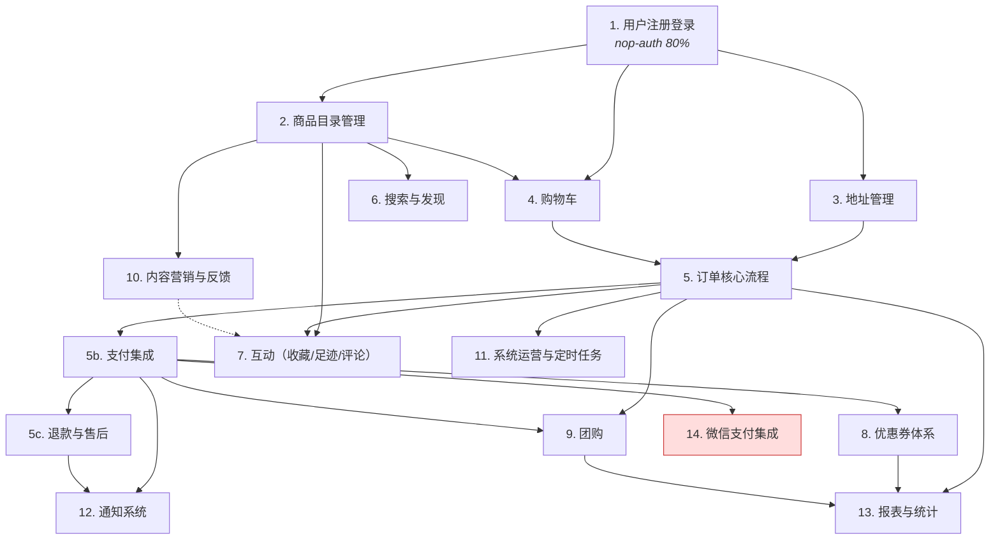

# Implementation Roadmap

> Last Updated: 2026-06-10
> Source: `docs/requirements/commercial-baseline.md`, `docs/design/*.md`

## Purpose

本文是设计到代码实现的全局状态索引。

**核心用途：** AI 读完本文后即可知道哪些能力尚未实现、哪些已有计划、哪些已经完成，无需重新遍历所有项目文档和代码。

本文不包含具体实现细节。每个 `planned` 状态的阶段由对应 execution plan 负责。

## Phase Status

> **这是唯一的动态状态区域。更新状态只改这里，不改 Phase Details 中的状态行。**

- 1. 用户注册登录: `todo`
- 2. 商品目录管理: `todo`
- 3. 地址管理: `todo`
- 4. 购物车: `done`
- 5. 订单核心流程: `done`
- 5b. 支付集成: `done`
- 5c. 退款与售后: `done`
- 6. 搜索与发现: `todo`
- 7. 互动（收藏/足迹/评论）: `todo`
- 8. 优惠券体系: `todo`
- 9. 团购: `todo`
- 10. 内容营销与反馈: `todo`
- 11. 系统运营与定时任务: `todo`
- 12. 通知系统: `todo`
- 13. 报表与统计: `todo`
- 14. 微信支付集成: `todo`

## Status Values

| Status | 含义 |
|--------|------|
| `todo` | 尚未开始，无对应 plan |
| `planned` | 已有对应 execution plan |
| `done` | 已完成并通过 closure audit |

## Nop Platform Reuse

以下能力由 Nop 平台内置模块直接提供，不需要从零构建：

| 能力 | 平台模块 | 说明 |
|------|----------|------|
| 用户认证（登录/登出/token 刷新/密码哈希） | `nop-auth` | 已引入依赖；`LoginApiBizModel` 提供完整登录流程 |
| 用户管理（CRUD/状态/角色分配/RBAC） | `nop-auth` | `NopAuthUser` + `NopAuthRole` + `NopAuthResource`；已引入依赖 |
| 系统配置（全局 key-value 变量） | `nop-sys` | `NopSysVariable`；已引入依赖 |
| 字典管理 | `nop-sys` | `NopSysDict` + `NopSysDictOption`；已引入依赖 |
| 通知模板 | `nop-sys` | `NopSysNoticeTemplate`；已引入依赖 |
| 定时任务调度 | `nop-job` | CRON/fixed-rate/fixed-delay 调度引擎；**未引入依赖** |
| 报表引擎 | `nop-report` | 报表定义/数据集/数据源/权限/导出；**未引入依赖** |
| SMS/Email 通道 | `nop-integration` | `ISmsSender` / `IEmailSender` 接口 + 多供应商实现；**未引入依赖** |
| 文件存储 | `nop-integration-file-*` | 本地/OSS/SFTP 后端；**未引入依赖** |

**对 roadmap 的影响：** 登录/登出/token 刷新/密码哈希等基础认证能力由平台提供，Phase 1 仅需 Delta 定制商城注册流程和 UI。系统配置存储由 `NopSysVariable` 提供，Phase 11 仅需配置消费逻辑。定时任务引擎由 `nop-job` 提供，Phase 11 仅需编写业务定时方法。报表引擎由 `nop-report` 提供，Phase 13 仅需定义数据集和模板。

## Current Baseline

**已有实现：**
- ORM 模型（35 实体，含字典、关系、i18n）
- 全部实体的代码生成脚手架（Entity、BizModel stub、API interface、I/O bean、generated view、custom view stub）
- `LitemallGoodsBizModel`：关键字查询 hook、保存/更新时的零售价同步和购物车同步
- `LitemallAftersaleBizModel`：批量审核、退款（含 PayService 调用、SMS 通知、库存回补）
- `NopAuthUserExBizModel`（delta）：日志记录、extAction1 查询
- 3 个测试类（Goods integration、Cart aggregate、Order aggregate）
- Admin 后台基础页面框架（AMIS view.xml，大部分为继承默认值）

**核心缺口：** 用户注册 Delta（需消除 LitemallUser）、地址管理、优惠券/团购体系、搜索、定时任务、通知、报表

---

## Phases

### First Commercial Loop（Phase 1 → 5c + 6）

商业基线（`commercial-baseline.md`）定义的第一个完整闭环。

| # | Phase | Owner Doc | 依赖 | Platform Reuse |
|---|-------|-----------|------|----------------|
| 1 | 用户注册登录 | `user-and-address.md` | 无 | nop-auth: 登录/登出/token/密码哈希/用户CRUD/RBAC；仅需 Delta 定制注册 + UI |
| 2 | 商品目录管理 | `product-catalog.md` | Phase 1（弱依赖；前台浏览公开） | — |
| 3 | 地址管理 | `user-and-address.md` | Phase 1 | — |
| 4 | 购物车 | `order-and-cart.md` | Phase 1 + Phase 2 | — |
| 5 | 订单核心流程 | `order-and-cart.md` | Phase 3 + Phase 4 | — |
| 5b | 支付集成 | `order-and-cart.md` | Phase 5 | — |
| 5c | 退款与售后 | `order-and-cart.md` | Phase 5b | — |
| 6 | 搜索与发现 | `product-catalog.md` | Phase 2（可与 3-5 并行） | — |

### Extended Capabilities

| # | Phase | Owner Doc | 依赖 | Platform Reuse |
|---|-------|-----------|------|----------------|
| 7 | 互动（收藏/足迹/评论） | `marketing-and-promotions.md` | Phase 2（收藏/足迹）；Phase 5（评论） | — |
| 8 | 优惠券体系 | `marketing-and-promotions.md` | Phase 5b | — |
| 9 | 团购 | `marketing-and-promotions.md` | Phase 5 + Phase 5b | — |
| 10 | 内容营销与反馈 | `marketing-and-promotions.md` | Phase 2 | — |
| 11 | 系统运营与定时任务 | `system-configuration.md` | Phase 5；Phase 8/9（可选延后） | nop-sys NopSysVariable; nop-job（需引入）; nop-integration-file-*（需引入） |
| 12 | 通知系统 | `system-configuration.md` | Phase 5b + Phase 5c | nop-integration ISmsSender/IEmailSender（需引入）; nop-sys NopSysNoticeTemplate |
| 13 | 报表与统计 | `system-configuration.md` | Phase 5 + Phase 8/9 | nop-report（需引入）；仅需 SQL 数据集和报表模板 |
| 14 | 微信支付集成 | `system-baseline.md` | Phase 5b | Protected Area (ask-first) |

---

## Phase Details

### 1. 用户注册登录

> Status: see Phase Status above

**目标：** 商城用户可通过用户名/密码注册和登录，查看/更新个人资料，修改密码。

**架构决策：** 取消独立 `LitemallUser` 实体，统一使用平台 `NopAuthUser` 通过 Delta 扩展。理由：字段高度重复（9/15）、角色体系完全由平台覆盖、消除双实体注册/状态同步/密码一致性等复杂问题。

**交付范围：**
- Delta 扩展 NopAuthUser：添加商城特有字段（lastLoginTime, lastLoginIp, userLevel, sessionKey）
- 消除 LitemallUser：ORM 模型中将引用 LitemallUser 的实体改为引用 NopAuthUser
- 消除 LitemallRole/LitemallPermission/LitemallUserRole/LitemallAdmin（已由平台覆盖）
- 商城用户注册 Delta（基于 NopAuthUser，通过 LoginApi 补充 BizModel 添加 signUp）
- 个人资料查看/更新（NopAuthUser 非凭证字段）
- 修改密码（复用平台 `changeSelfPassword`）
- 禁用用户拦截（平台已内置，验证即可）
- 后台用户管理页面
- 单元测试

**不在范围内：** 微信登录、外部登录渠道

**Protected Area：** Auth/permissions delta 变更属于 Protected Area（`plan-first`）

**模块：** app-mall-delta、app-mall-web、app-mall-service、app-mall-dao（ORM 模型变更）

### 2. 商品目录管理

> Status: see Phase Status above

**目标：** 管理员管理分类/品牌/商品（含 SKU/规格/属性）；用户按分类和品牌浏览已上架商品。

**交付范围：**
- 分类树管理（两级，排序，叶子分类校验，删除保护）
- 品牌管理
- 商品完整管理（基于现有 GoodsBizModel 补充上下架/新品热门标记）
- SKU 库存校验
- 规格管理 + 属性管理（LitemallGoodsAttribute）
- 前台分类导航 + 品牌筛选 + 商品详情
- 后台管理页面定制
- 单元测试

**不在范围内：** 搜索（Phase 6）、收藏/足迹（Phase 7）

**模块：** app-mall-service、app-mall-web

### 3. 地址管理

> Status: see Phase Status above

**目标：** 登录用户管理收货地址，支持默认地址切换和数量限制。

**交付范围：**
- 地址 CRUD（用户隔离）
- 默认地址切换
- 地址数量限制（读取 NopSysVariable 配置）
- 地区级联数据（Region，SQL seed 初始化）
- 前台地址管理页面
- 单元测试

**模块：** app-mall-service、app-mall-web

### 4. 购物车

> Status: see Phase Status above

**目标：** 登录用户加入购物车、管理购物车行、预览结算。

**交付范围：**
- 加入购物车（按 SKU + 数量，同 SKU 合并）
- 查看购物车（商品信息/规格/数量/勾选状态/小计）
- 修改数量（库存约束）
- 勾选/取消勾选（单项和全部）
- 删除/清空
- 结算预览（基于已勾选商品展示价格）
- 前台购物车页面
- 单元测试

**不在范围内：** 优惠券计算（Phase 8）、团购价格（Phase 9）、运费（Phase 5）

**模块：** app-mall-service、app-mall-web

### 5. 订单核心流程

> Status: see Phase Status above

**目标：** 用户从购物车提交订单，管理员发货；覆盖订单状态机主线。

**交付范围：**
- 订单创建（从已勾选购物车行，快照商品/SKU/地址/价格）
- 订单状态机（待支付→用户取消/系统取消/已支付→已发货→用户已收货/系统已收货）
- 用户取消待支付订单
- 管理员发货（记录承运信息/运单号）
- 用户确认收货
- 运费计算（读取 NopSysVariable 配置；Phase 11 之前使用 seeded 默认值）
- 价格构成：orderPrice = goodsPrice + freightPrice - couponPrice；couponPrice/grouponPrice/integralPrice 本阶段默认为零
- 购物车行清除
- 后台订单管理页面 + 前台订单列表/详情
- 单元测试

**不在范围内：** 支付（Phase 5b）、退款/售后（Phase 5c）、自动任务（Phase 11）、优惠券（Phase 8）、团购（Phase 9）

**模块：** app-mall-service、app-mall-web、app-mall-api

### 5b. 支付集成

> Status: see Phase Status above

**目标：** 订单支付确认推进到已支付；包含模拟支付用于开发/测试。

**交付范围：**
- PayService 本地模拟实现
- 支付确认→已支付状态
- 零金额订单直接视为已支付
- 集成测试

**不在范围内：** 微信支付（Phase 14，Protected Area ask-first）

**模块：** app-mall-service、app-mall-api

### 5c. 退款与售后

> Status: see Phase Status above

**目标：** 已支付未发货订单退款；已收货订单售后申请和审核。

**交付范围：**
- 用户申请退款（已支付未发货）
- 管理员直接退款 / 审核退款（通过/驳回）
- 售后申请（仅退款、退货退款）
- 售后审核（管理员审核/执行退款）
- 用户撤回售后
- 后台售后管理页面 + 前台售后入口
- 单元测试

**Protected Area：** 退款涉及支付和数据删除路径

**模块：** app-mall-service、app-mall-web

### 6. 搜索与发现

> Status: see Phase Status above

**目标：** 用户按关键字搜索商品，支持分类/品牌过滤和排序。

**交付范围：**
- 前台关键字搜索已上架商品
- 分类/品牌过滤 + 排序（价格/上新/默认）
- 后台搜索（不受上下架限制）
- 搜索关键字管理（LitemallKeyword：热门/默认）
- 搜索历史（记录/查看/清空）
- 前台搜索页面
- 单元测试

**模块：** app-mall-service、app-mall-web

### 7. 互动（收藏/足迹/评论）

> Status: see Phase Status above

**目标：** 用户收藏商品、记录足迹、评价已收货订单商品。

**交付范围：**
- 收藏商品（专题收藏随 Phase 10 补充）
- 收藏状态查询
- 浏览足迹（记录/查看/清空）
- 评价提交（已收货订单商品，一商品一次，时间窗口）
- 评价展示（含星级）
- 管理员评价管理（查看/审核/回复）
- 前台页面
- 单元测试

**模块：** app-mall-service、app-mall-web

### 8. 优惠券体系

> Status: see Phase Status above

**目标：** 管理员管理优惠券；用户领取/兑换/在结算时使用。

**交付范围：**
- 优惠券规则管理（适用范围：全场/分类/商品）
- 通用领取 + 注册赠券 + 兑换码券
- 有效性校验（金额门槛/商品范围/有效期）
- 结算时选券 + couponPrice 纳入订单价格
- 取消/退款后恢复券
- 前台领券中心 + 结算页选券 + 后台管理页面
- 单元测试

**模块：** app-mall-service、app-mall-web、app-mall-api

### 9. 团购

> Status: see Phase Status above

**目标：** 管理员创建团购规则；用户开团/参团；团购成功影响价格。

**交付范围：**
- 团购规则管理（绑定商品）
- 开团 + 参团
- 资格校验（不能加入自己的团/不能重复加入）
- 成功/失败判定（支付参与者数量/超时）
- grouponPrice 纳入订单价格
- 前台团购页面 + 后台管理页面
- 单元测试

**模块：** app-mall-service、app-mall-web

### 10. 内容营销与反馈

> Status: see Phase Status above

**目标：** 管理员管理专题/广告/FAQ；用户浏览和提交反馈。

**交付范围：**
- 专题管理（关联商品/阅读量）
- 广告管理（时间窗口/启停）
- FAQ 管理
- 反馈提交与处理
- 前台页面 + 后台管理页面
- 补充专题收藏（Phase 7 扩展）
- 单元测试

**模块：** app-mall-service、app-mall-web

### 11. 系统运营与定时任务

> Status: see Phase Status above

**目标：** 系统配置可管理；定时任务自动执行超时处理；文件存储可用；公告可管理。

**交付范围：**
- 系统配置管理（消费 NopSysVariable；运费/超时/地址上限等）
- 管理员操作日志（LitemallLog）
- 引入 nop-job 依赖，编写 5 个定时任务：
  - 自动取消超时未支付订单
  - 自动确认超时未收货订单
  - 优惠券过期（依赖 Phase 8，可延后集成）
  - 团购过期（依赖 Phase 9，可延后集成）
  - 评价窗口过期
- 文件存储（评估 LitemallStorage vs nop-integration-file-*）
- 公告管理（LitemallNotice + LitemallNoticeAdmin）
- 后台管理页面
- 单元测试

**模块：** app-mall-service、app-mall-web、app-mall-app（定时任务）

### 12. 通知系统

> Status: see Phase Status above

**目标：** 业务事件触发通知投递。

**交付范围：**
- 引入 nop-integration 依赖
- 业务事件到通知消息的转换
- 支付确认通知 + 发货通知 + 后台订单提醒
- SMS 通道集成
- 后台通知记录
- 单元测试

**模块：** app-mall-service、app-mall-api

### 13. 报表与统计

> Status: see Phase Status above

**目标：** 后台查看订单/商品/用户/运营统计。

**交付范围：**
- 引入 nop-report 依赖
- 定义数据集（SQL）：订单统计、商品统计、用户统计
- 创建报表模板
- 后台统计看板
- 单元测试

**模块：** app-mall-service、app-mall-web

### 14. 微信支付集成

> Status: see Phase Status above

**目标：** 接入微信支付替代模拟支付。

**Protected Area：** ask-first

**交付范围：**
- PayService 微信支付实现 + 支付回调
- 退款接口对接
- 微信支付配置管理
- 集成测试

**模块：** app-mall-wx、app-mall-service

---

## Dependency Graph

## Entity Coverage

35 个 ORM 实体：

| 实体 | Phase | 备注 |
|------|-------|------|
| LitemallUser | 1 | Delta 扩展 NopAuthUser，原实体消除 |
| LitemallAddress | 3 | |
| LitemallRegion | 3 | SQL seed |
| LitemallCategory | 2 | |
| LitemallBrand | 2 | |
| LitemallGoods | 2 | 已有部分逻辑 |
| LitemallGoodsProduct | 2 | |
| LitemallGoodsSpecification | 2 | |
| LitemallGoodsAttribute | 2 | |
| LitemallCart | 4 | |
| LitemallOrder | 5 | |
| LitemallOrderGoods | 5 | |
| LitemallAftersale | 5c | 已有部分逻辑 |
| LitemallKeyword | 6 | |
| LitemallSearchHistory | 6 | |
| LitemallCollect | 7 | |
| LitemallFootprint | 7 | |
| LitemallComment | 7 | |
| LitemallCoupon | 8 | |
| LitemallCouponUser | 8 | |
| LitemallGrouponRules | 9 | |
| LitemallGroupon | 9 | |
| LitemallTopic | 10 | |
| LitemallAd | 10 | |
| LitemallIssue | 10 | |
| LitemallFeedback | 10 | |
| LitemallSystem | 11 | 评估是否迁移到 NopSysVariable |
| LitemallStorage | 11 | 评估是否迁移到 nop-integration-file-* |
| LitemallNotice | 11 | |
| LitemallNoticeAdmin | 11 | |
| LitemallLog | 11 | |
| LitemallAdmin | — | 消除：nop-auth NopAuthUser 覆盖 |
| LitemallRole | — | 消除：nop-auth NopAuthRole 覆盖 |
| LitemallPermission | — | 消除：nop-auth NopAuthResource 覆盖 |
| LitemallUserRole | — | 消除：nop-auth NopAuthUserRole 覆盖 |

## Cross-Cutting

| 关注点 | 说明 |
|--------|------|
| 错误处理 | NopException + ErrorCode |
| 权限控制 | 后台管理员认证，用户操作用户认证，前台浏览公开 |
| 测试 | 每阶段核心路径单元测试，遵循 Nop 测试模式 |
| Owner Doc 同步 | 阶段完成时更新相关 design/architecture 文档 |
| Dev Log | 每次实现后更新 docs/logs/ |
| View 定制化 | 默认 view → 业务定制 view |
| XMeta 定制化 | BizModel 方法对应的 xmeta 定义 |
| integralPrice | 当前基线保持为零 |

## Rule

- 本文档是状态索引和粗粒度划分，不是 execution plan
- 每个 `planned`/`in-progress` 阶段由对应 execution plan 负责细节
- 持久化模型以 `model/*.orm.xml` 为准
- 阶段状态变更只需更新 Phase Status 列表（本文档顶部）
