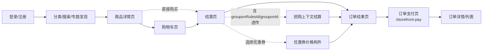
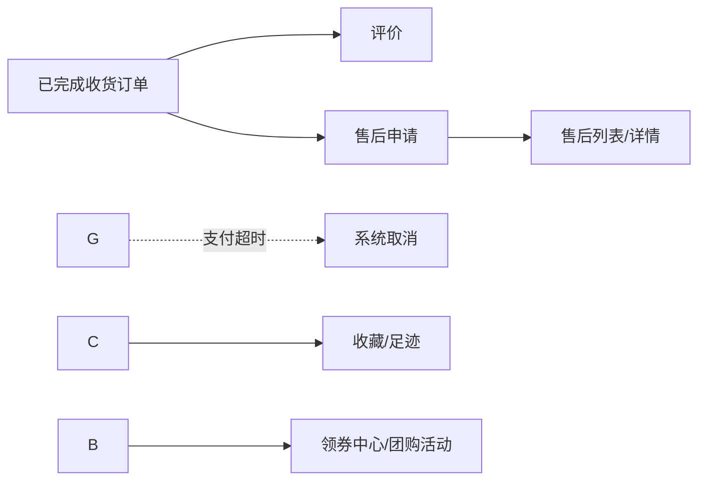
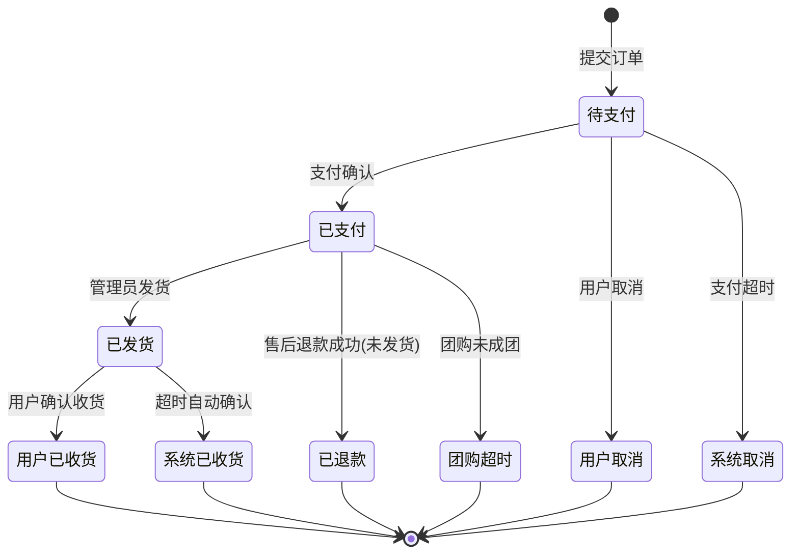
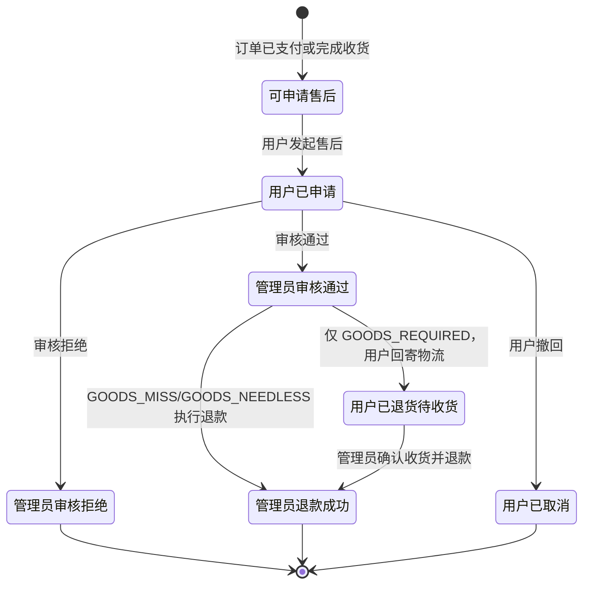

# 全局流程总览

## 目的

本文档是 `nop-app-mall` 的流程总纲，按三层结构组织：

- L1 宏观页面流：用户在前台各域之间的导航路径
- L2 状态机：订单主状态机与售后状态机
- L3 跨域公共规则：贯穿多域的资格、快照与恢复语义

各域的详细业务规则在其独立 owner doc 中定义，本文只提供全局视图和跨域映射，不重复域内规则。

## 边界

- 本文件负责全局流程串联、状态-域-文档-页面映射和跨域公共规则。
- 每个状态、动作的完整业务规则以对应域 owner doc 为准。
- 持久化状态码字典以 `model/app-mall.orm.xml` 为准。
- 支付、调度等技术实现以 `docs/architecture/` 为准。

## 文档地图

| 业务域 | Owner Doc |
|--------|-----------|
| 商品目录 | `product-catalog.md` |
| 订单与购物车（含支付、退款、售后） | `order-and-cart.md` |
| 用户与地址 | `user-and-address.md` |
| 营销与促销（优惠券、团购、评论、内容） | `marketing-and-promotions.md` |
| 系统配置与运营 | `system-configuration.md` |
| 角色与权限 | `roles-and-permissions.md` |

---

## L1 — 宏观页面流

### 购买主链路

### 营销与履约后路径

---

## L2 — 订单主状态机

状态码与持久化字典见 `order-and-cart.md` 的订单状态机章节，以 `model/app-mall.orm.xml` 为准。

### 售后状态机（独立于订单主状态）

售后状态机不改写订单主状态机已表达的履约结果，只在其上补充后置服务结果。详细流转规则见 `order-and-cart.md` 退款与售后章节（含「退货履约（GOODS_REQUIRED）子状态机」RETURNED 子路径）。

---

## 状态-域-文档-页面映射

| 状态 | 归属域 | Owner Doc | 关联页面 |
|------|--------|-----------|---------|
| 待支付 | 订单 | `order-and-cart.md` | 订单结果页、订单支付页 |
| 用户取消 | 订单 | `order-and-cart.md` | 订单列表 |
| 系统取消 | 订单 | `order-and-cart.md` | 订单列表 |
| 已支付 | 订单 | `order-and-cart.md` | 订单详情 |
| 退款中 | 订单 | `order-and-cart.md` | 订单详情 |
| 已退款 | 订单 | `order-and-cart.md` | 订单详情 |
| 团购超时 | 订单 × 营销 | `order-and-cart.md` / `marketing-and-promotions.md` | 订单列表 |
| 已发货 | 订单 | `order-and-cart.md` | 订单详情 |
| 用户已收货 | 订单 | `order-and-cart.md` | 订单详情 |
| 系统已收货 | 订单 | `order-and-cart.md` | 订单详情 |
| 可申请售后 | 售后 | `order-and-cart.md` | 售后申请 |
| 用户已申请 | 售后 | `order-and-cart.md` | 售后列表 |
| 管理员审核通过 | 售后 | `order-and-cart.md` | 售后详情 |
| 用户已退货待收货 | 售后 | `order-and-cart.md` | 售后后台"待收货"Tab |
| 管理员退款成功 | 售后 | `order-and-cart.md` | 售后详情 |
| 管理员审核拒绝 | 售后 | `order-and-cart.md` | 售后详情 |
| 用户已取消（售后） | 售后 | `order-and-cart.md` | 售后列表 |

---

## L3 — 跨域公共规则

### 资格前置

[规则] 购物车维护、结算、订单提交、地址管理、售后申请均要求用户已完成认证。

[规则] 结算项必须来自当前已勾选的购物车选择或等价的直接购买路径，且收货地址必须归属于当前用户。

[规则] 评价资格以"订单完成收货"为边界；售后资格更宽，覆盖已支付未发货（未收货退款）与已完成收货（退款/退货退款）两类，以 `order-and-cart.md` 售后章节与 `model/app-mall.orm.xml` aftersale-type 字典为准。

### 价格与库存实时性

[规则] 结算与订单提交必须基于当前可售价格和库存，而不是沿用购物车中的过期假设。

[规则] 优惠券是否可用必须在结算时按当前订单上下文重新校验，而不是只基于历史领券结果静态展示。

[规则] 运费策略与包邮门槛以系统配置为准，结算时必须明确展示是否收取运费或已免运费。

### 快照语义

[规则] 订单提交时固化所购商品、SKU 选择、价格构成（含优惠构件）和配送信息快照。

[规则] 即使后续商品目录、地址记录或优惠券规则变化，订单详情也必须保留原始含义。

[规则] 评论一旦对外展示，其业务含义应与原订单商品快照一致，不跟随后续商品资料变化重写。

### 恢复语义

[规则] 订单取消或符合恢复条件的退款后，优惠券可按既定规则回到可用语义。

[规则] 团购失败或超时后，该次活动失去继续参团资格，但不自动改变团购规则本身是否仍可供后续新活动使用。

[规则] 售后审核拒绝或用户撤回后，本次售后流程结束，订单仍保持既有履约结果。

### 团购上下文透传

[规则] 团购开团/参团经"加购 → 结算"路径，通过 URL 参数 `grouponRulesId` / `grouponId` 透传到 submit，由订单侧价格语义消费团购优惠结果。

[规则] 团购是否成功由有效支付参与者数量决定，而非下单意图；团购超时由订单侧触发相应状态迁移。

### 支付模式分流

[规则] 支付入口统一跳转 `/storefront-pay?orderId=...`，按 `actualPrice` 与 `orderStatus` 路由三个互斥分支：零金额待支付直接确认、非零金额待支付进入 prepay+二维码+轮询、非待支付仅展示状态。

[规则] 真实模式下非零金额订单必须经支付回调推进；示例模式（支付能力未启用）由模拟入口确认。

## 参考文档

| 文档 | 位置 | 说明 |
|------|------|------|
| 订单与购物车 | `order-and-cart.md` | 订单状态机、价格构成、支付、退款、售后详细规则 |
| 商品目录 | `product-catalog.md` | SKU 可售性、价格、库存约束 |
| 营销与促销 | `marketing-and-promotions.md` | 优惠券、团购、评价资格 |
| 用户与地址 | `user-and-address.md` | 认证前置、地址归属 |
| 系统配置 | `system-configuration.md` | 运费、包邮门槛、支付开关 |
| 持久化模型 | `model/app-mall.orm.xml` | 状态码字典、字段真相 |
